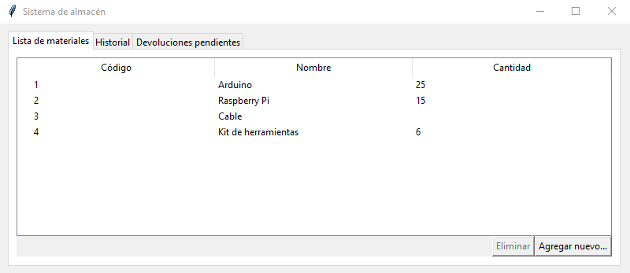
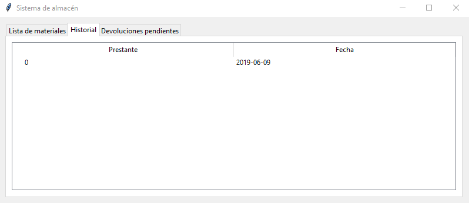
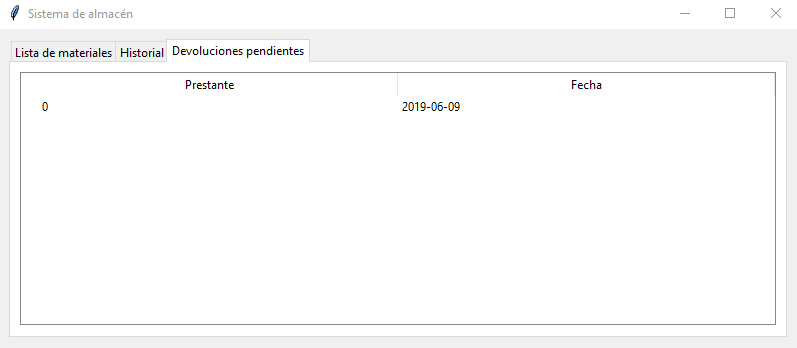
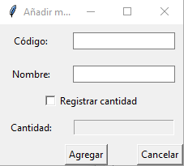
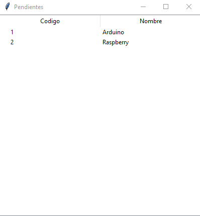
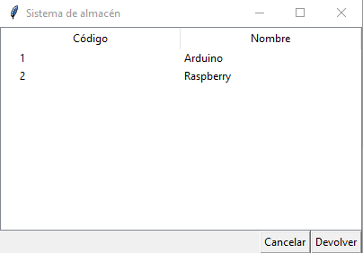
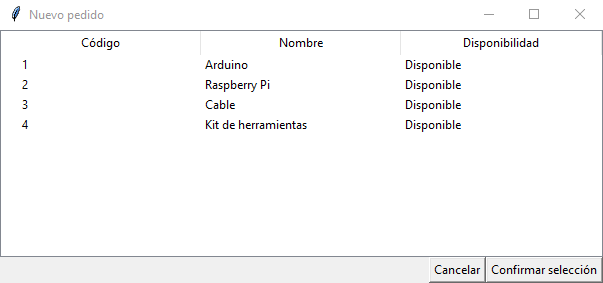

## Guía de instalación

### Hardware

#### Requisitos:

- Raspberry Pi 3 o superior.
- Tarjeta MicroSD 8 GB o más.
- Ratón y techado USB.
- Monitor HDMI.
- Sensor RFID MFRC522.

#### Instalación:

1. Instale todos los componentes con su respectivo cableado y conecte la Raspberry Pi a la energía.
2. Conecte el sensor RFID a la Raspberry de la siguiente manera:

|Pin sensor|Pin Raspberry|
|--|--|
|SDA|24|
|SCK|23|
|MOSI|19|
|MISO|21|
|GND|6|
|RST|22|
|3.3v|1|

Mapa de pines de la Raspberry Pi:

### Software

#### Requisitos:

- Sistema operativo para Raspberry Pi instalado (haga click [aquí](https://raspberryparatorpes.net/instalacion/noobs-paso-a-paso-instalar-el-sistema-operativo-en-la-raspberry-pi/) para instalar paso a paso Raspbian).
- MongoDB. Para instalarlo, junto con todas sus dependencias en Raspbian, escriba en la terminal `sudo apt-get install mongodb`.
- Python 3. Para instalarlo, junto con todas sus dependencias en Raspbian, escriba en la terminal `sudo apt-get install python3`. 
- Python package Index. Para instalarlo, junto con todas sus dependencias en Raspbian, escriba en la terminal `sudo apt-get install python3-pip`. 
- PyMongo. Para instalarlo, junto con todas sus dependencias en Raspbian, escriba en la terminal `sudo apt-get install python3-pymongo`. 
- Actualice todos sus paquete escribiendo en la terminal `sudo apt-get update`.
- Active la interfaz SPI de la Raspberry Pi. Para esto, escriba en la terminal `sudo raspi-config`, luego navegue con las flechas del teclado hasta llegar a Interfaces, seleccione la opción y luego navegue hasta SPI y acepte.

**Nota:** Para asegurar que los cambios hayan sido efectuados, reinicie la Raspberry y posteriormente escriba `service mongodb start` y `service mongodb status` en la terminal. Si el mensaje le avisa que el servicio funciona correctamente, podemos continuar.

#### Instalación:

- Clone el repositorio usando git (para instalar, ejecute `sudo apt-get git`) con el siguiente comando: `git clone https://github.com/dcalled1/SistemaAlmacen.git`.
- Acceda a la carpeta del repositorio escribiendo `cd SistemaAlmacen`.
- Instale los paquetes necesarios del proyecto. Para esto, solamente tiene que ejecutar `sudo pip3 install -r requeriments.txt`. Asegúrese de estar en el directorio del proyecto.

## Ejecución

Ejecute el fichero [MainApp.py](MainApp.py), mediante el siguiente comando: `python3 MainApp.py`.

## Guía de usuario

Al ejecutar el programa, lo primero que encontraremos será un menú que contiene la lista de los materiales disponibles, que tienen un nombre, un id y una cantidad de la disponibilidad del material. En la parte superior podemos cambiar de pestaña entre materiales, historial y devoluciones:  

En historial se encuentran la fecha en que se hizo un pedido y el id del carnet con el que se pidió.

En devoluciones se encuentra la fecha de todos los materiales que falten por devolver en general y el id del carnet de la persona que lo pidió. 

### Uso sin carnet puesto: 

En la ventana de materiales podemos agregar nuevos materiales con el botón “material” que hayan llegado a la bodega asignándole un id, su nombre y una cantidad opcional. El botón de eliminar elimina de la base de datos el material que se haya insertado y por ende de la lista de materiales. 

En la ventana de historial, al seleccionar un pedido se abrirá otra nueva ventana con la información del nombre y el id de cada material que hizo el pedido. 

En la ventana de historial, al seleccionar un pendiente, se abrirá otra nueva ventana con la información del nombre y el id de cada material que está pendiente por devolver. 

### Uso con carnet puesto: 

Cuando se pone un carnet en el lector, abrirá una nueva ventana según una de 2 opciones: Si la persona aún tiene materiales por devolver o si por lo contrario no tiene pendientes. 

Si la persona tiene materiales por devolver se seleccionarán los materiales que esta persona tiene por devolver de la base de datos y se mostrarán allí. Aquí existe un botón de ‘devolver’ que devolverá todos los materiales que la persona tenía o podrá simplemente cancelar la acción con el botón ‘cancelar’ que cierra la ventana. 

Si la persona no tiene pendientes se mostrarán en la interfaz el nombre y el id de los materiales disponibles. El usuario podrá seleccionar todos los materiales que quiera pedir y se verifica con el botón ‘confirmar’, estos serán agregados al historial y a devoluciones pendientes. 

## Herramientas usadas:

- **Interfaz gráfica:** [Tkinter Tcl/Tk](https://docs.python.org/3.7/library/tkinter.html).
- **Base de datos:** [MongoDB](https://www.mongodb.com/).

## Integrantes

- David Calle Daza.
- Felipe Ríos López.